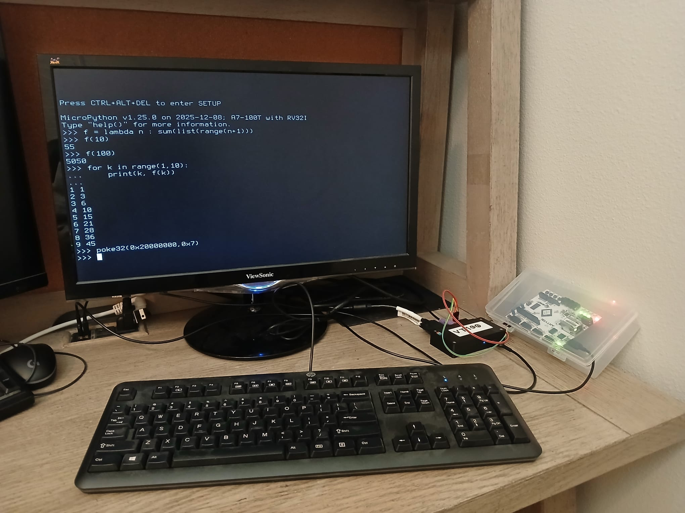

# FPGA-MicroPython
MicroPython on Digilent Arty A7-100T FPGA board

## Introduction

  

  MicroPython on Digilent Arty A7-100T FPGA board with a VT100 terminal box.

I have tested MicroPython on a bare-metal RISC-V RV32I system implemented on an FPGA board. The processor is RV32I with no extensions, RAM is 300K, and the clock speed is 100 MHz. There are only two I/O peripherals, a UART RX/TX and a GPIO. See the Verilog code for full details. No Xilinx specific stuff is used except for the clock domain synchronizers.

## Summary

The RISC-V RV32I Verilog design and the testbench is from https://github.com/YosysHQ/picorv32, I have done only minor edits.

The UART RX/TX and FIFO buffers are from Pong P. Chu's book "FPGA Prototyping by Verilog Examples", again I have done only minor edits.

To build the MicroPython from source, you will need the GCC compiler. I used the following link to download the pre-compiled toolchain, https://github.com/stnolting/riscv-gcc-prebuilt/releases/download/rv32i-131023/riscv32-unknown-elf.gcc-13.2.0.tar.gz

I have used Ciro Cattuto's RISC-V emulator and build scripts, https://github.com/ccattuto/riscv-python. Ciro's repo has really detailed information. I have only edited the linker script for 300K RAM and UART RX/TX behaviour. Changed the board name, and added an optional startup script for peek32/poke32.

I am also sharing the HEX file that can be used in a Vivado project, plus the pre-built bin image for programming the FPGA.

## References
1. PicoRV32 - A Size-Optimized RISC-V CPU, https://github.com/YosysHQ/picorv32
2. Verilog codes from Pong P. Chu's book "FPGA Prototyping by Verilog Examples", https://github.com/fpga-logi/logi-pong-chu-examples/tree/master/pong-chu-logi-edu-examples-verilog
3. Ciro Cattuto's RISC-V emulator and build scripts, https://github.com/ccattuto/riscv-python
4. VT100 emulator box, https://www.tindie.com/products/petrohi/geoffs-vt100-terminal-kit/
5. MS Basic + WOZMON on a 6502 system (Arty A7-35T), https://github.com/m1geo/BE6502-FPGA

